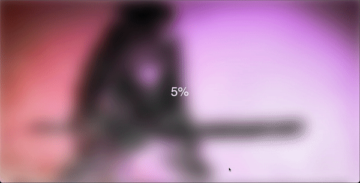

# Blurry Loading
This project is a simple implementation of a blurry loading effect using HTML, CSS, and JavaScript. When the page is loaded, the background image gradually transitions from a blurry state to a clear state, creating a visually appealing loading effect.

## Preview

# Technologies Used

- HTML
- CSS
- JavaScript

## Features

- Blurry loading effect
- Smooth transition animation
- Responsive design

## Getting Started

To get started with this project, follow these steps:

1. Clone the repository.
2. Open the `index.html` file in your preferred web browser.
3. Customize the project according to your needs.

## Acknowledgement

The project is part of the "50 projects in 50 days - HTML, CSS & Javascript" course on Udemy by Brad Traversy.
